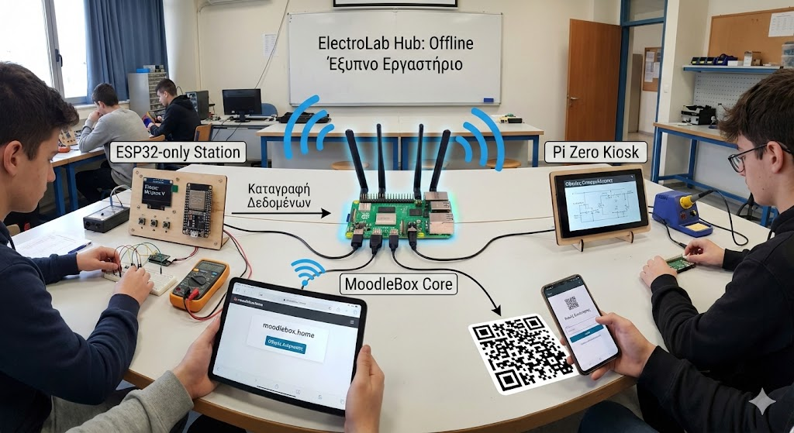
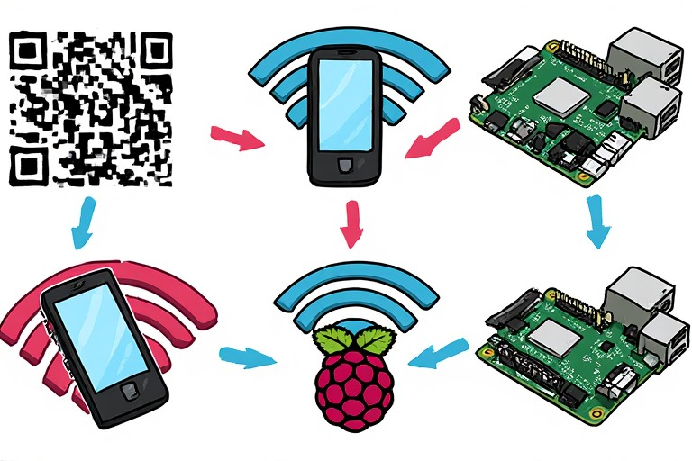
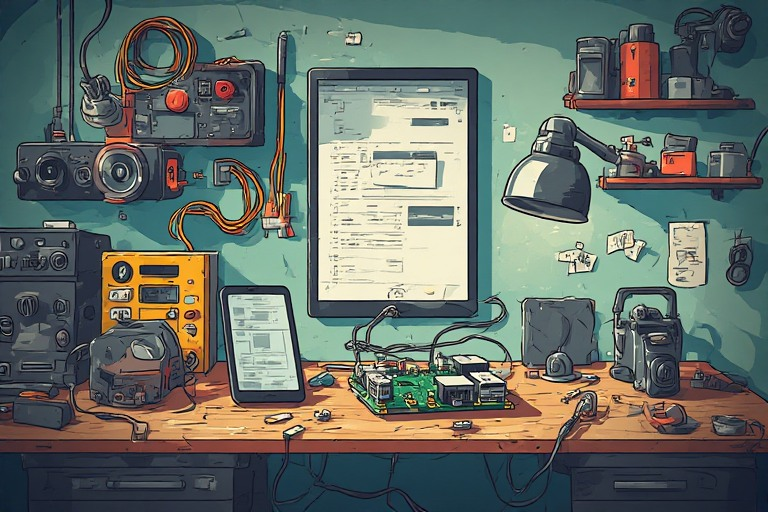

# ⚡ Watt-Fi-Academy-2026      ⚡ 
## Η ισχύς εν τη... συνδέσει!
Πρόταση έργου για την συμμετοχή της ομάδας μας στον «8ο Πανελλήνιο Διαγωνισμό Ανοιχτών Τεχνολογιών στην Εκπαίδευση»

---


**Ομάδα:  "ElectroHercules"** Μαθητές από εσπερινό ΕΠΑΛ ΑΛΙΑΡΤΟΥ 

**Τίτλος έργου:** «Watt-Fi-Academy-2026 »

---

Καλωσορίσατε στο **Watt-Fi Academy**! Εδώ, η κλασική ηλεκτρολογία συναντά την ψηφιακή καινοτομία. Μετατρέπουμε το εργαστήριο σε έναν "ζωντανό" οργανισμό όπου η γνώση ρέει ασύρματα, αλλά... **Offline**.

Το project μας είναι ένα "έξυπνο" εργαστηριακό οικοσύστημα που βασίζεται στο **MoodleBox** (Raspberry Pi 5) και σε τοπικούς σταθμούς **ESP32** & **Pi Zero**. Δημιουργούμε ένα τοπικό Wi-Fi δίκτυο που δεν χρειάζεται Internet, επιτρέποντας στους μαθητές να εκτελούν ασκήσεις, να βλέπουν οδηγίες και να καταγράφουν την πρόοδό τους χρησιμοποιώντας απλώς το κινητό (στους εκπαιδευτικούς χώρους που επιτρέπεται) ή τα tablets του σχολείου.
___
___
## Εισαγωγή – Περιγραφή
Το **Watt-Fi-Academy** είναι μια ολοκληρωμένη πρόταση για ένα “έξυπνο” εργαστήριο **Ηλεκτρονικών**, σχεδιασμένο με βασική αρχή τη **λειτουργία Offline**: το εργαστήριο αποκτά το δικό του τοπικό Wi‑Fi και μια πλήρη εκπαιδευτική πλατφόρμα (Moodle) που λειτουργεί χωρίς εξάρτηση από σύνδεση στο Internet. 

Ο **βασικός κορμός** του συστήματος είναι γενικού σκοπού: ένα offline εκπαιδευτικό “intranet τάξης/εργαστηρίου” που μπορεί να χρησιμοποιηθεί και σε άλλα γνωστικά αντικείμενα (φιλολογικά μαθήματα, μαθηματικά ή οποιοδήποτε άλλο μάθημα, περιέχοντας οδηγίες, ασκήσεις, αρχεία αξιολόγησης κτλ.). Στην πρότασή μας, το προσαρμόζουμε ώστε να καλύπτει **κυρίως τις ανάγκες ενός εργαστηρίου ηλεκτρονικών**: καθοδηγούμενες ασκήσεις, διαδικασίες ασφάλειας/σωστής χρήσης οργάνων, γρήγορη εύρεση πρόβληματος (troubleshooting) και καταγραφή προόδου δεξιοτήτων.

Οι μαθητές συνδέονται στο Wi‑Fi του MoodleBox με **κινητό ή tablet** (ή laptop) και μπαίνουν στη διεύθυνση `http://moodlebox.home/` από browser. 
Επειδή η καθημερινότητα του Εσπερινού ΕΠΑΛ απαιτεί ευελιξία, το υλικό των δραστηριοτήτων (φύλλα ασκήσεων , οδηγοί, εγχειρίδια χρήσης εξοπλισμού κτλ.) είναι οργανωμένο έτσι ώστε οι μαθητές να μπορούν να το **κατεβάζουν στη συσκευή τους** στο σχολείο και να το μελετούν και στο σπίτι, ενώ οι αξιολογήσεις/καταχωρήσεις (κουίζ και προσπάθειες στους σταθμούς) καταγράφονται στο MoodleBox όταν βρίσκονται στο εργαστήριο.

Η πρόταση είναι ρεαλιστική: **υλοποιούμε σίγουρα τον βασικό κορμό** (MoodleBox + Offline λειτουργία + QR ροές + μαθήματα/κουίζ) και επεκτείνουμε σε σταθμούς/AI ανάλογα με τον χρόνο και τις ενάγκες του εργαστηριακού μαθήματος.

---



---


## Το Πρόβλημα που Επιλύουμε
### Α. Χαμένος χρόνος από επαναλαμβανόμενες οδηγίες
Σε ένα εργαστήριο ηλεκτρονικών, μεγάλο μέρος της ώρας καταναλώνεται σε επαναλήψεις: “τι συνδέω πού”, “πώς μετράω σωστά”, “γιατί δεν ανάβει”, “ποια κλίμακα επιλέγω στο πολύμετρο”. Αυτό μειώνει το καθαρό λειτουργικό χρόνο και δημιουργεί άνιση υποστήριξη (όποιος προλάβει τον εκπαιδευτικό). Καταργούμε την ανάγκη για εκτυπωμένα φύλλα εργασίας. Όλα τα εργαστηριακά εγχειρίδια και οι ασκήσεις βρίσκονται ψηφιακά στο MoodleBox, μειώνοντας το περιβαλλοντικό αποτύπωμα του σχολείου.

### Β. Ομαδική Εργασία χωρίς "Μπερδέματα"
Κάθε εργαστηριακός πάγκος διαθέτει τη δική του ψηφιακή "πινακίδα" άσκησης μέσω **QR**. Οι ομάδες εργάζονται ταυτόχρονα και αυτόνομα, έχοντας πρόσβαση σε εξειδικευμένες οδηγίες για κάθε συνδεσμολογία.
### Γ. Φορητότητα & Προσαρμογή
Οι ασκήσεις μας δεν είναι "κλειδωμένες" σε ένα μέρος. Το  **Watt-Fi Academy** μπορεί να μεταφερθεί σε οποιοδήποτε σχολείο, ανεξάρτητα από τον εξοπλισμό ή τις πινακίδες που διαθέτει, αφού το περιεχόμενο προσαρμόζεται εύκολα.

### Δ. Ασφάλεια/ορθή χρήση εξοπλισμού χωρίς ενιαία ροή
Οι βασικές οδηγίες ασφαλούς χρήσης (τροφοδοτικά, πολύμετρα, κολλητήρια, γενική τάξη στον πάγκο) συχνά υπάρχουν σε χαρτί ή “στο μυαλό” του υπεύθυνου. Χρειαζόμαστε οδηγίες που εμφανίζονται **τη σωστή στιγμή**, πριν από την πράξη, στον ίδιο τον πάγκο.

### Ε. Μη μετρήσιμη πρόοδος δεξιοτήτων
Σήμερα είναι δύσκολο να τεκμηριωθεί με στοιχεία ποιος κατέκτησε μια δεξιότητα (π.χ. μετρήσεις V/I, υπολογισμός R, σωστή διαδικασία ελέγχου), πόσες προσπάθειες χρειάστηκε και πού δυσκολεύεται η τάξη. Θέλουμε ένα εργαστήριο που αφήνει “ίχνος μάθησης” (καταγραφές προσπαθειών) ώστε να βελτιώνεται συνεχώς.

---

---

##  Αναγκαιότητα του Έργου – Στόχοι
### Πρωτεύοντες στόχοι (ο βασικός κορμός)
1. **Offline λειτουργία χωρίς Internet**: το εργαστήριο δουλεύει ακόμα και αν “πέσει” το δίκτυο ή δεν υπάρχει υποδομή. <!-- [web:14] -->  
2. **Σύνδεση μαθητών με κινητό ή tablet** στο Wi‑Fi του MoodleBox και πρόσβαση στο Moodle από browser. <!-- [web:80] -->  
3. **QR ανά πάγκο και ανά βασικό όργανο** για οδηγίες, ασφάλεια, και έναρξη δραστηριότητας/κουίζ.  
4. **Ροές μάθησης με ξεκλείδωμα** (οδηγίες → κουίζ εκκίνησης → άσκηση → καταχώρηση → επόμενο επίπεδο), ώστε να υπάρχει σταθερή διαδικασία.

### Στόχοι επέκτασης (ελπίζουμε να υλοποιήσουμε όλους τους στόχους)
5. **Δύο τύποι σταθμών** για διαφορετικές ανάγκες μάθησης:
   - 1× **ESP32-only** για σύντομες “hands‑on” ασκήσεις και άμεση ανατροφοδότηση.
   - 1× **Pi Zero** σε ρόλο kiosk για οπτικές οδηγίες/προσομοιώσεις και troubleshooting.  
6. **Αυτόματη καταχώρηση αποτελεσμάτων** στο MoodleBox (προσπάθειες, χρόνος, PASS/FAIL) μέσω τοπικού API.

---

##  Κοινωνική Επίδραση
### Άμεσος αντίκτυπος στη σχολική κοινότητα
Το ElectroLab Hub μετατρέπει το εργαστήριο σε πιο οργανωμένο και ασφαλές περιβάλλον: η γνώση “κατεβαίνει” στον πάγκο, μέσα από QR οδηγίες και μικρά κουίζ εκκίνησης, και μειώνονται οι φθορές/λάθη από κακή διαδικασία. Ο εκπαιδευτικός κερδίζει χρόνο για ουσιαστική διδασκαλία και εξατομικευμένη υποστήριξη, αντί για συνεχή επανάληψη των ίδιων οδηγιών.

### Έμφαση στην ισότητα πρόσβασης (ευαίσθητοι πληθυσμοί)
Ο σχεδιασμός Offline δεν είναι μόνο τεχνική επιλογή· είναι επιλογή **κοινωνικής δικαιοσύνης**. Ένα MoodleBox‑κεντρικό σύστημα μπορεί να λειτουργήσει σε περιοχές με χαμηλή συνδεσιμότητα (αγροτικές/απομακρυσμένες), σε περιβάλλοντα όπου το Internet είναι ασταθές, αλλά και σε πλαίσια όπου η πρόσβαση στο διαδίκτυο δεν είναι εφικτή ή επιθυμητή (π.χ. κλειστά περιβάλλοντα, κέντρα κράτησης φυλακισμένων, απομακρυσμένες περιοχές).   

Επιπλέον, το περιεχόμενο μπορεί να γίνει **πολυγλωσσικό** (Ελληνικά/Αγγλικά/επιπλέον γλώσσα κοινότητας), ώστε μαθητές με μεταναστευτικό υπόβαθρο να έχουν ασφαλείς οδηγίες και πρόσβαση σε βασικές έννοιες χωρίς γλωσσικό αποκλεισμό.

---

##  Εκπαιδευτική Αξία (Εσπερινό ΕΠΑΛ)
Το Εσπερινό ΕΠΑΛ έχει μαθητές με διαφορετικές εμπειρίες, συχνά περιορισμένο χρόνο και ανομοιογενές υπόβαθρο. Το Watt-Fi-Academy υποστηρίζει την αυτονομία: ο μαθητής βλέπει οδηγίες, κάνει γρήγορο έλεγχο κατανόησης (κουίζ), εκτελεί την άσκηση και παίρνει ανατροφοδότηση, χωρίς να περιμένει “σειρά” για βοήθεια.

Για τους μαθητές που θα υλοποιήσουν το έργο, είναι ένα ολοκληρωμένο project IoT/εκπαιδευτικής τεχνολογίας: embedded συστήματα (ESP32), σχεδίαση διεπαφών (kiosk), δομή μαθησιακών ροών, τεκμηρίωση σε GitHub και παραγωγή επαναχρησιμοποιήσιμου εκπαιδευτικού υλικού.

---

---

##  Τεχνική Αρχιτεκτονική (offline-first)
Το MoodleBox λειτουργεί ως αυτόνομο “κέντρο” που δημιουργεί Wi‑Fi δίκτυο και φιλοξενεί το Moodle, ώστε οι συσκευές να έχουν πρόσβαση στο περιεχόμενο και στις δραστηριότητες **τοπικά**. 
Η πρόσβαση γίνεται από browser στη διεύθυνση `http://moodlebox.home/`. 

```

                 (Προαιρετικό)
                [Internet για updates]
                       |
                       | (δεν απαιτείται)
                       v
    ┌───────────────────────────────────────────────────────────┐
    │                MoodleBox (Raspberry Pi 5)                 │
    │   Wi‑Fi + Moodle + Περιεχόμενο + Καταγραφές + Τοπικό API  │
    └───────────────┬───────────────────────────────────────────┘
                    │ Wi‑Fi (Offline)
         ┌──────────┴───────────┐
         │                      │
         ┌────▼────┐            ┌────▼────┐
         │ ESP32   │            │ Pi Zero  │
         │ Station │            │ Kiosk    │
         └────┬────┘            └────┬─────┘
         │                       │
         │προσπάθειες (HTTP/JSON)│ browser σε δραστηριότητες
         └──────────────┬────────┘
                        │
                        ▼
              Καταχώρηση στο MoodleBox

```

---

##  Υποσυστήματα

###  MoodleBox Core (Raspberry Pi 5) — ο κεντρικός κορμός

**Τι είναι:** Το MoodleBox είναι μια αυτόνομη λύση που λειτουργεί χωρίς Internet και συνδυάζει ασύρματο access point με πλήρες Moodle περιβάλλον.   
**Πώς το χρησιμοποιούμε:** Οι μαθητές συνδέονται στο Wi‑Fi και ανοίγουν `http://moodlebox.home/` από browser και ξεκινάνε την υλοποίηση.   
**Τι προσφέρει στο έργο:**
- Μαθήματα, φύλλα εργασίας, αρχεία, κουίζ, καταγραφές προόδου.
- Κεντρική οργάνωση “ασφάλεια → οδηγίες → άσκηση → τεκμηρίωση”.
- Σχεδιασμό για επέκταση (π.χ. πρόσθετοι πάγκοι/σταθμοί).

---

###  ESP32-only Station — σταθμός άσκησης με άμεση ανατροφοδότηση

**Τι είναι:** Ένας μικρός και ανθεκτικός τοπικός σταθμός που λειτουργεί σαν “μικρό όργανο” με οθόνη και κουμπιά και υλοποιεί μικρές ασκήσεις.  
**Τι κάνει:**  
- Δίνει στόχο (π.χ. “Υπολόγισε R από τις μετρήσεις V και I”).  
- Δέχεται απάντηση/βήματα από τον μαθητή.  

**Γιατί είναι σημαντικό:** Ενισχύει την αυτονομία και μετατρέπει την άσκηση σε μετρήσιμη δεξιότητα, χωρίς να επιβαρύνει τον εκπαιδευτικό με χειροκίνητες καταχωρήσεις.

---

###  Pi Zero Kiosk — σταθμός οπτικών οδηγιών & troubleshooting
**Τι είναι:** Ένας σταθερός σταθμός προβολής (kiosk) δίπλα στο εργαστήριο/πάγκο, που ανοίγει συγκεκριμένες δραστηριότητες/οδηγούς στο MoodleBox.  
**Τι κάνει:**  
- Παρουσιάζει βήμα-βήμα οδηγίες με εικόνες/διαγράμματα.  
- Προσφέρει “οδηγό επίλυσης βλάβης (troubleshooting)” με λογική ερωτήσεων/απαντήσεων (π.χ. έλεγχος πολικότητας, έλεγχος γείωσης, σωστή κλίμακα πολυμέτρου).  
- Καταγράφει ότι ο μαθητής χρησιμοποίησε τη διαδικασία υποστήριξης, ώστε να ξέρουμε πού δυσκολεύεται η τάξη.

**Γιατί είναι σημαντικό:** Μετατρέπει τα συχνά προβλήματα σε επαναχρησιμοποιήσιμη ροή, μειώνοντας τη σύγχυση και αυξάνοντας τη συνέπεια του εργαστηρίου.

---

## Αρθρωτότητα & Επεκτασιμότητα

  

### Γιατί Αρθρωτή Αρχιτεκτονική;

  

Το Watt-Fi-Academy δεν είναι "μονολιθικό". Κάθε συστατικό (MoodleBox, ESP32, QR) μπορεί να αναβαθμιστεί ή να αντικατασταθεί χωρίς να σπάσει το σύνολο.

  

### Παραδείγματα Επέκτασης

  

#### 1. Περισσότεροι ESP32 Σταθμοί

**Σήμερα:** 2 σταθμοί.

**Αύριο:** 4–6 σταθμοί για διαφορετικές θέματα (RF, PWM, Ψηφιακές Εισόδους, κ.λπ.).


  

#### 2. Μεγάλος Υπολογιστής (ή NAS)

**Σήμερα:** Raspberry Pi 5.

**Αύριο:** Εάν η σχολή θέλει να φιλοξενήσει Moodle για πολλαπλές τάξεις, ένας εργαστήρι-δικτυακός διακομιστής.


  

#### 3. Άλλες Εκπαιδευτικές Περιοχές

**Σήμερα:** Ηλεκτρονικά.

**Αύριο:** Τα ίδια QR / κουίζ / σταθμοί για:

- Μαθηματικά (διαδραστικό κουίζ λογισμού, προσομοιώσεις).

- Φυσική (γραφήματα, πειράματα).

- Λογιστική (ηλεκτρονικές φόρμες, υπολογιστή αριθμών).

  

#### 4. AI Chatbot (Μελλοντικό)

Αν υπάρχει χρόνος και εμπειρία, στο τέλος του έργου:

- Ενσωματωμένο στο MoodleBox: "Ρωτήστε με ό,τι θέλετε σχετικά με τάση/ρεύμα".

- Χρησιμοποιεί ένα τοπικό μοντέλο ή API.

  

---

  

## Μελλοντικές Επεκτάσεις

  

### Βραχυπρόθεσμες (3–6 μήνες)

  

1.  **AI-Powered Troubleshooting Bot**

- "Ρωτήστε με γιατί το κύκλωμά σας δεν λειτουργεί".

- Χρησιμοποιεί GPT ή ανοιχτό μοντέλο.

- Φιλοξενείται τοπικά στο MoodleBox (Ollama).

  

2.  **Προσομοιωτής Κυκλώματος (Online & Offline)**

- Χρησιμοποιεί TINA-TI ή Ngspice.

- Πρακτική: "Σχεδίασε αυτό το κύκλωμα" → προσομοίωση → πραγματικό κύκλωμα.

  

3.  **Εκθέσεις Περισσότερο Ανταγωνιστικά**

- Εξαγωγή δεδομένων σε CSV.

- Σύγκριση με προηγούμενα έτη ή σχολές.


---

##  Σενάρια λειτουργίας
### Σενάριο Α — QR → οδηγίες/ασφάλεια → κουίζ → άσκηση
1. Ο μαθητής σκανάρει QR στον πάγκο.  
2. Ανοίγει σελίδα με οδηγίες και βασικούς κανόνες.  
3. Ξεκινά μικρό κουίζ εκκίνησης.  
4. Μετά το κουίζ, εκτελεί την άσκηση στον αντίστοιχο σταθμό (ESP32 ή Pi Zero).

### Σενάριο Β — Άσκηση στον ESP32 → καταχώρηση προσπάθειας
1. Ο μαθητής εκτελεί κύκλωμα χαμηλής τάσης (με ασφαλείς διαδικασίες).  
2. Ο ESP32 δίνει μετρήσεις/στόχο και λαμβάνει απάντηση.  
3. Στέλνεται καταγραφή προσπάθειας στο MoodleBox (χρόνος, προσπάθειες, αποτέλεσμα).

### Σενάριο Γ — Πρόβλημα → Pi Zero kiosk → troubleshooting
1. Ο μαθητής ανοίγει τον οδηγό troubleshooting.  
2. Ακολουθεί βήματα και επιστρέφει στην άσκηση.  
3. Καταγράφεται ότι χρειάστηκε υποστήριξη, ώστε να βελτιώσουμε το υλικό/τη διδασκαλία.

---

## QR ροές (Οδηγίες – Ασφάλεια – Κουίζ)
Θα χρησιμοποιήσουμε 3 τύπους QR:
1. **QR Άσκησης (ανά πάγκο):** οδηγίες + έναρξη κουίζ + σύνδεση στην άσκηση.  
2. **QR Ασφάλειας (ανά όργανο):** ασφαλής χρήση τροφοδοτικού/πολύμετρου/κολλητηριού, βασικοί κανόνες εργαστηρίου.  
3. **QR Αναφοράς προβλήματος:** “λείπει/χάλασε” → φόρμα αναφοράς.


---

# Κατασκευή

---

##  Υλικά – Προϋπολογισμός 

Στόχος μας είναι πιλοτική υλοποίηση εντός προϋπολογισμού, με:

| υλικό        | περιγραφή        |
|----------------|----------------|
| 1× MoodleBox Core | (Raspberry Pi 5 + αποθήκευση + τροφοδοσία + θήκη) |
| 1× ESP32-only Station | (ESP32 ή Pi Zero + μικρή οθόνη + κουμπιά + βασικά υλικά πάγκου) |
| 1× Pi Zero Kiosk | (Pi Zero + μικρή οθόνη)  |
|Αναλώσιμα|(καλώδια, breadboards, QR αυτοκόλλητα, μικρά κουτιά, αντιστάσεις πηνία για βασικές ασκήσεις ηλεκτρολογίας)|

